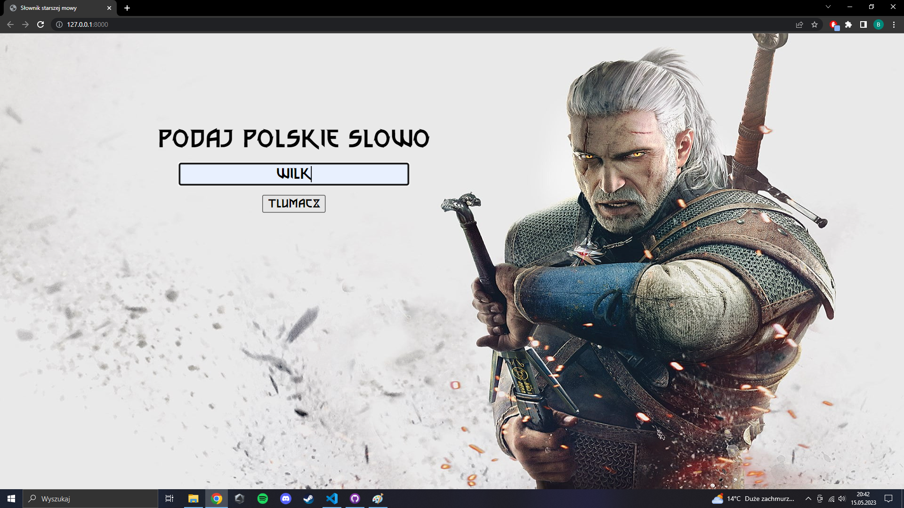

# Slownik-starszej-mowy

Interface in Polish lang

instalacja bibliotek:

pip install -r requirements.txt

Wymagany jest serwer MySQL

Wymagane dane znajdują się w pliku .env.example należy utworzyć plik .env i podać tam swoje klucze według wzoru

Opis: Słownik internetowy wykorzystujący bazę danych MySQL oraz FastApi, który po wprowadzeniu Polskiego słowa wyszukuje jego odpowiednik w starszej mowie z Wiedźmina.

Folder templates zawiera widoki html.

Folder Static zawiera pliki statyczne, są tam style, grafika i czcionka.

Folder test_files zawiera pliki które są potrzebne do testów jednostkowych.

Plik plik.py otwiera plik data.txt gdzie wkleiłem wszystkie znane słowa. 
Źródło:https://wiedzmin.fandom.com/wiki/S%C5%82ownik_starszej_mowy 
Następnie rozdziela je według danych jakie podałem i tworzy osobny plik dla każdej pierwszej litery polskiego słowa.

Plik loading.py ładuje wszystkie dane do bazy gdzie nazwa tabeli odpowiada nazwie pliku tzn plik A.txt tworzy tabele A gdzie dane są odpowiednio przypisane.

Plik load_data_to_database.sh ładuje dane do bazy danych wykorzystując pliki plik.py oraz loading.py, po zaladowaniu danych kasuje powstałe foldery, mozna recznie uruchomic plik.py a nastepnie loading.py aby zaladowac dane.

Plik mydb.py służy do łączenia się z bazą danych, gdy potrzebuje się połączyć z bazą to go importuje zamiast pisać w kółko to samo.

Plik query wysyła zapytanie do bazy o podane słowo i następnie wyciąga wynik z bazy.

Plik tests.py zawiera testy, których używałem aby sprawdzić działanie aplikacji.

Plik main.py jest główną aplikacją, która korzysta z frameworka FastApi aby za pomocą Uvicorna uruchomić aplikację w przeglądarce, aby ją uruchomić należy wpisać uvicorn main:app --reload w terminalu, w lokalizacji gdzie znajduje się main.py.

